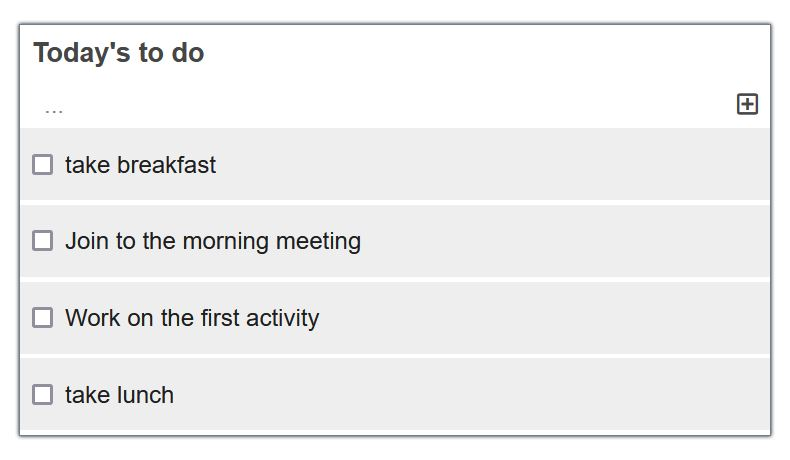

# to-do-list

#To-do-list Project

> A simple App that allows a user to make a to-do-list.


## Built With

- Javascript, HTML and CSS

## Live Demo

[Live Demo Link](https://medaminedev66.github.io/to-do-list/dist/)
## Getting Started

- In terminal or Command line. Navigate to a directory in your local storage where you'd like to store the project and paste ```https://github.com/medaminedev66/to-do-list.git```
- Open your terminal and run `npm install` to install the node packages.
- Run `npm run start` to run the project.

## Author

👤 **Amine Smahi**

- GitHub: [@medaminedev66](https://github.com/medaminedev66 )
- LinkedIn: [Amine Smahi](https://www.linkedin.com/in/mohammed-amine-smahi-1b8615187/)

## Show your support

Give a ⭐️ if you like this project!

## Acknowledgments

- Thanks to [Microverse]()

## 📝 License

This project is [MIT](./MIT.md) licensed.
